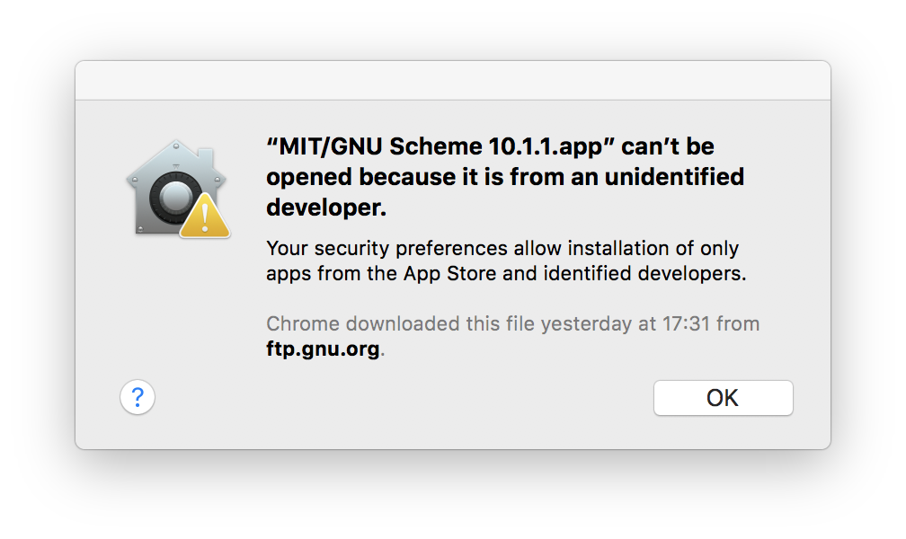

# some solution for mac problems

## Mac 下 Zip 压缩包解压后文件名出现乱码，怎么解决？
Mac OS 下，Zip 格式的压缩包解压之后出现乱码，是因为别人压缩制作这个 Zip 压缩包的时候，用的是非UTF-8编码（如Windows中文版的默认字符编码为 GB2312），而 Mac 自带的 归档实用工具 解压 Zip 格式文件的时候使用的字符编码是 Mac OS 默认的字符编码（UTF-8），所以导致解压后的文件名出现乱码。

使用解压软件 `The Unarchiver` 来解压 Zip 格式的文件。
refer to <http://biang.io/blog/development/tools/os/osx/other/Mac-Zip-package-after-decompression-file-name-appear-garbled-how-to-solve>

## [How can I prevent an SSH session from hanging in OS X Terminal?](https://apple.stackexchange.com/questions/36690/how-can-i-prevent-an-ssh-session-from-hanging-in-os-x-terminal)

__For keeping the connection alive__, you can check in `/etc/ssh/ssh_config` the line where it says `ServerAliveInterval`, that tells you how often (in seconds) your computer is gonna send a null packet to keep the connection alive. If you have a 0 in there that indicates that your computer is not trying to keep the connection alive (it is disabled), otherwise it tells you how often (in seconds) it is sending the aforementioned packet. Try putting in 120 or 240, if it is still killing your connection, you can go lower, maybe to 5, if with that number it doesn't happen, maybe it is your router who is dumping the connection to free memory.

__For killing it when it gets hang up__, you can use the ssh escape character:

```sh
~.
```
That is, press the tilde and then the period, if it doesn't work, press Enter before you press that, that will kill the connection immediately.

## ["some app" can't be opened beacuse it is from an unidentified developer.]




click the left bottom button, a Mac help will popup.

1. In the Finder, locate the app you want to open.</br>
    Don’t use Launchpad to do this. Launchpad doesn’t allow you to access the shortcut menu.

2. Control-click the app icon, then choose Open from the shortcut menu.

3. Click Open. </br>
    The app is saved as an exception to your security settings, and you can open it in the future by double-clicking it just as you can any registered app.


## [How to view Root directory and subdirectories in Finder?](https://apple.stackexchange.com/questions/34871/how-to-view-root-directory-and-subdirectories-in-finder)

### Go to hidden folder
`Shift`-`Command`-`G` in Finder brings up a "Go to folder" dialog. Type in the name of the directory, for example, /usr/local. Finder will show the directory. I use this with Finder in 'View as Columns'

If the subfoler doesn't show in current foler
Enter in Terminal:
```sh
sudo chflags nohidden directoryname
```
Whereby directory name is the name of the directory that you want to see in Finder.

Reverse this by typing:
```sh
sudo chflags hidden directoryname
```
